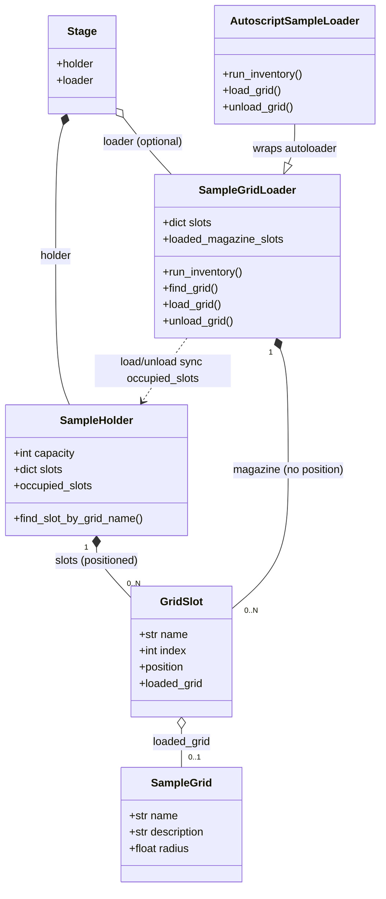

# AutoscriptSampleLoader — hardware plan (loader only)

**Status (2026-06-22):** `AutoscriptSampleLoader` **implemented** in
`fibsem/microscopes/autoscript.py` (unit-tested with a fake autoloader, **not**
hardware-tested). **Not yet wired** into `_create_sample_stage` (selection step
pending). Scope: map the AutoScript autoloader onto our `SampleGridLoader`
abstraction. The cryo compartment (dewar / temperature) is **out of scope** —
see "Deferred".

## Data model

`Stage` owns a `SampleHolder` and an optional `SampleGridLoader`. Both contain
`GridSlot`s — but **holder** slots carry a stage `position` and report occupancy
via `SampleHolder.occupied_slots`, while **loader** magazine slots are storage
only (`position = None`). Each `GridSlot` holds 0..1 `SampleGrid`. The loader
moves grids between magazine and working slots via `load_grid` / `unload_grid`,
which keep the holder's `occupied_slots` in sync.



**Caveat:** the source is the AutoScript 4.13 *release notes* (method names +
introduced-version only). We do **not** have the matching 4.10+/4.13 API
reference locally (the bundled `AutoscriptDocumentation` predates 4.10 — it has
`loadlock`/`compustage`/`sputter_coater` but **no `autoloader`**). Several
signatures are, however, **confirmed from working operator code** (see "Confirmed
from working code"); the rest are still assumptions to verify on hardware.

## Confirmed from working code

From a working `id_available_grids` / `autoloader_control` implementation:

- **`get_slots(run_inventory: bool)`** takes a bool:
  - `get_slots(False)` → returns the **last-known** slot states (a slot may read
    `'Unknown'` if no scan has run yet).
  - `get_slots(True)` → performs a **physical inventory scan**.
  - Pattern: call `get_slots(False)`; if **every** slot's `state == 'Unknown'`,
    fall back to `get_slots(True)` to force a scan.
- **`AutoloaderSlot.state`** is a string ∈ `{'Unknown', 'Occupied', 'Empty'}`.
- **`AutoloaderSlot.id`** is an `int`.
- **`load(grid_id: int)`** — loads by slot/grid **id**.
- **`unload()`** — no args.
- A grid that is **loaded onto the stage** makes its magazine slot read
  `'Empty'`; the on-stage grid is inferred as the slot that *was* `'Occupied'`
  (in `available_grids`) but now reads `'Empty'`.
- **No `dock()` / `undock()`** appear in the inventory/load/unload path — basic
  exchange does not call them (may be for other sequences, or not needed).
- Canonical path is `microscope.specimen.autoloader` (one call in the source used
  a bare `microscope.autoloader.unload()` — treat as an alias/typo).

Example (operator code):

```python
slots = microscope.specimen.autoloader.get_slots(False)
if all(s.state == 'Unknown' for s in slots):
    slots = microscope.specimen.autoloader.get_slots(True)   # force scan
available = [s for s in slots if s.state == 'Occupied']
...
microscope.specimen.autoloader.load(new_grid_id)             # load by id
microscope.specimen.autoloader.unload()
```

## AutoScript autoloader API (Arctis / xT 28.x)

From the release notes. Core added in **4.10.0**; temperature sensors in 4.13.0.

`microscope.specimen.autoloader`
- `is_installed`
- `get_slots()` → list of `AutoloaderSlot`
- `get_compartment()` → `CryoCompartment` (deferred)
- `load()` / `unload()` — load / unload a sample
- `dock()` / `undock()` — dock / undock the loader to the stage
- `stage.sample_description`, `stage.state` — what is currently on the stage

`AutoloaderSlot` — `id`, `sample_description`, `state`

`CryoCompartment` (deferred) — `state`, `dewar_level`,
`go_to_cryo_temperature()`, `go_to_room_temperature()`, `refill_dewar()`,
`run_cryo_cycle()`, `get_available_temperature_sensors()`,
`get_sensor_temperature()`

## What we have today

`fibsem/microscopes/_stage.py` — `SampleGridLoader` (concrete, **simulated**).
Two slot sets, both `GridSlot`:
- **magazine** (`loader.slots`, default 12) — the storage inventory a human
  loads. `run_inventory()`, `loaded_magazine_slots`, `assign_grid()`,
  `find_grid()`. Magazine slots have **`position = None`**.
- **holder working slot(s)** (`holder.slots`) — the beam position, with a real
  `position`. `load_grid(slot, grid)` / `unload_grid(slot)` insert/retract; the
  holder reports occupancy via **`SampleHolder.occupied_slots`** (the loader no
  longer owns this — it used to expose `loaded_slots`, now removed).

`GridSlot.position` is **`Optional`** (None for magazine slots).

Wiring: `_create_sample_stage(microscope)` builds the `Stage`. Today a
`SampleGridLoader` is created **only for CompuStage** (simulated timings);
`loader = None` otherwise. Consumers: `GridTaskManager.ensure_loaded()` uses
`holder.find_slot_by_grid_name` / `holder.occupied_slots` / `loader.find_grid` /
`loader.load_grid` / `loader.unload_grid`.

## Mapping → `AutoscriptSampleLoader`

| `SampleGridLoader` (abstract)            | `specimen.autoloader` (real)                              | Confidence |
|------------------------------------------|-----------------------------------------------------------|-----------|
| `run_inventory()`                        | `get_slots(False)`; if all `'Unknown'` → `get_slots(True)` | **confirmed** |
| `loaded_magazine_slots`                  | `get_slots(False)`, filter `state == 'Occupied'`          | **confirmed** |
| `find_grid(name)`                        | `get_slots(...)`, match `AutoloaderSlot.id` (or `sample_description`) | high |
| `load_grid(slot, grid)`                  | `load(grid_id: int)` (blocks), then mirror into the holder working slot | **confirmed (args)** |
| `unload_grid(slot)`                      | `unload()`, then clear the holder working slot            | **confirmed (args)** |
| current grid on stage ("what's loaded")  | `SampleHolder.occupied_slots` (kept in sync by load/unload). `autoloader.stage.*` deferred to a future `refresh_from_hardware()` | implemented (model side) |
| `assign_grid(slot, grid)`                | **N/A** — magazine contents are hardware-reported, not set by us | n/a |
| installed?                               | `autoloader.is_installed`                                  | high      |

Slot identity is the **`int` id**, not a name — `GridSlot.index`/`name` should
carry `AutoloaderSlot.id`, and `load()` takes that id directly.

`AutoloaderSlot.id` is the **physical slot position** in the magazine (the
addressable slot number passed to `load(id)`), not a list index — the demo ids
`1, 3, 4, 6` are non-contiguous, and `get_slots()` returns all physical slots.
It looks **1-based**. Confirm on hardware: 0- vs 1-based, and the slot range /
magazine capacity (does `get_slots()` return a fixed `1..N`). Our `GridSlot.index`
is 0-based, so the mapping `AutoloaderSlot.id` ↔ `GridSlot.index` needs the right
offset.

Notes:
- `autoloader.stage` is a **sub-object of the autoloader** (current sample on the
  stage), distinct from `specimen.stage` (the motion stage). Don't conflate.
- Our magazine `GridSlot`s should mirror `get_slots()` (key by `AutoloaderSlot.id`),
  syncing `SampleGrid.name` ↔ `AutoloaderSlot.sample_description`.
- `assign_grid` (operator places a named grid in a magazine slot) has no hardware
  equivalent — on real hardware the magazine is physically loaded and we *read*
  it via `get_slots()`. Keep `assign_grid` for the simulated path only.

## Design approach

1. ✅ Keep `SampleGridLoader` as the base + the demo/simulated default.
2. ✅ **`AutoscriptSampleLoader(SampleGridLoader)`** in
   `fibsem/microscopes/autoscript.py` (alongside `AutoscriptGISPort` /
   `AutoscriptSputterCoater`) overrides `run_inventory`, `_sync_slots`,
   `load_grid`, `unload_grid`, `is_installed` to call
   `parent.connection.specimen.autoloader`. The magazine is synced on demand
   (`run_inventory()`), **not** on construction. `load_grid`/`unload_grid` mirror
   the result into the holder working slot so `SampleHolder.occupied_slots`
   reflects the hardware.
3. ⬜ **Selection** (mirrors the sputter-coater pattern, *not done yet*): in the
   loader-construction path, if the autoloader is present + installed
   (`getattr(specimen, "autoloader", None)` and `.is_installed`), build an
   `AutoscriptSampleLoader`; else the current behaviour. Decide where: a
   Thermo-side hook (preferred, keeps `_create_sample_stage` backend-agnostic)
   vs. a lazy import inside `_create_sample_stage`.
4. ✅ Sync magazine slots from `get_slots()` on inventory; `AutoloaderSlot.id` →
   `GridSlot.index`/`name` (`Slot-NN`), `sample_description` → `SampleGrid.name`
   (falling back to the slot name when empty).

## Decisions (resolved)

These were open questions; now settled for the first implementation:

1. **`load(id)` blocks** — assume it's synchronous and returns when the exchange
   is finished. No polling needed.
2. **`dock()` / `undock()`** — **ignored for now.** Not in the basic exchange
   path; revisit only if hardware requires it.
3. **`autoloader.stage`** ≈ our `SampleHolder` working slot — it reports the grid
   **currently loaded on the microscope stage**
   (`sample_description` → name, `stage.state` → state). *Implementation choice:*
   rather than read it for occupancy, `load_grid`/`unload_grid` keep the holder
   working slot in sync and `SampleHolder.occupied_slots` is the source of truth.
   `autoloader.stage` is deferred to a future `refresh_from_hardware()` (e.g. to
   pick up a grid already loaded at startup).
4. **After `load(id)`** the grid is in the stage/slot position — **nothing to do
   afterwards** (no coordinate handoff / `move_to_slot`).
5. **No timeout / error handling** at this stage — keep it simple; let exceptions
   propagate.
6. **`sample_description` may be empty** — so the reliable handle is the **`int`
   id**; treat `sample_description` as the grid name *when present*, else fall
   back to id.

## Remaining work

- **Selection wiring** — instantiate `AutoscriptSampleLoader` when
  `specimen.autoloader.is_installed`, else the current behaviour (design step 3).
- **`refresh_from_hardware()`** — read `autoloader.stage` (+ `get_slots`) to sync
  the model with a grid already loaded at startup.
- **`AutoloaderSlot.id` ↔ `GridSlot.index` offset** — resolve once the 0/1-based
  question is confirmed (see below).

## Still to confirm on hardware

- `AutoloaderSlot.id` 0- vs 1-based, and the magazine capacity / slot range.
- `autoloader.stage.state` enum values (for display only).
- Whether `load(id)` truly blocks; error/timeout behaviour (none handled yet).

## Deferred (not in this plan)

- **`CryoCompartment`** abstraction (dewar level, cryo/room temperature, refill,
  `run_cryo_cycle`, sensors). Matters for a real Arctis workflow but is a
  separate concern; design when the loader lands.

## Related code

- `fibsem/microscopes/autoscript.py` — **`AutoscriptSampleLoader`** (implemented),
  alongside `AutoscriptGISPort` / `AutoscriptSputterCoater`
- `fibsem/microscopes/_stage.py` — `SampleGridLoader`, `SampleHolder`
  (`occupied_slots`), `GridSlot` (optional `position`), `_create_sample_stage`,
  `Stage`, `SampleGrid`
- `fibsem/applications/autolamella/workflows/tasks/grid_manager.py` —
  `ensure_loaded()` (the main loader consumer)
- `tests/test_autoscript_sample_loader.py` — loader unit tests (fake autoloader)
- Source: `AutoScript Release Notes (4.13)` — autoloader API on p.14; method list
  pp.43–47.
