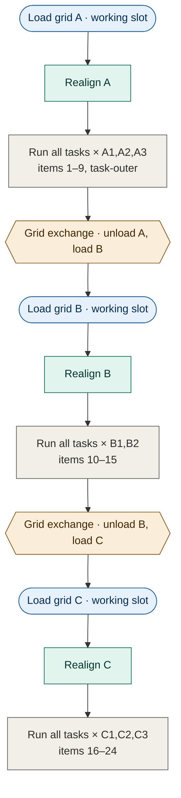

# Multi-Grid Lamella Execution

**Status:** Phase 1 implemented (2026-06-26) — **plan-object model** below landed and tested: `build_plan` bakes the order, `TaskQueue.build_from_plan` stores it, `TaskManager._run_queue` walks it and skips in place, with the shared `should_skip`. `plan_for_run` is the shared entry point used by both the runner and the UI preview; the UI guard is replaced by a loader-aware preflight (`workflows/run_preflight.py`) that blocks a static holder with unloaded grids and otherwise confirms the exchange cost + any skipped work. Phases 2–4 outstanding.
**Scope:** Running lamella task workflows across lamellae that live on *different* grids, including grids that are not currently loaded — on both autoloader and static-holder systems.
**Related:** [grid-workflow-system.md](grid-workflow-system.md) (the grid task layer and stage abstractions this builds on).

---

## 1. Intention

Today the lamella `TaskManager` runs a matrix of *(task × lamella)* work items, but it implicitly assumes **every selected lamella is already reachable** — i.e. its grid is sitting in the working slot. The UI enforces this with a guard that *blocks* any run whose selected lamellae span an unloaded grid ([`AutoLamellaMainUI._on_run_workflow_clicked`](../../fibsem/applications/autolamella/ui/AutoLamellaMainUI.py)).

The intention of this work is to remove that limitation and make the contract simply:

> **Run these tasks on these lamellae, regardless of which grid they are on.**

The user selects a flat list of lamellae — which may span any number of grids, loaded or not — and a set of tasks. The system is responsible for loading the right grid at the right time, minimising physical grid exchanges, and persisting results as it goes. This is what enables **unattended multi-grid, multi-day runs**: queue up a whole session's worth of lamellae across many grids and let it work through them.

### What this is *not*

- It is **not** a special "run-lamella-workflow" grid task wrapped inside the grid campaign. An earlier draft proposed exactly that, but it bakes in a rigid *one grid-outer pass* and a false hierarchy (grid workflow "owns" lamella workflow). We explicitly reject it: lamella execution should be independently multi-grid, and we cannot assume a single sweep through the grids is always sufficient.
- It is **not** a second orchestrator sitting above the lamella manager. There is one manager; grid loading becomes a behaviour *inside* it.

### Why this is now the natural design

We previously rejected "teach the lamella manager about grids" on the grounds that it would **duplicate loading logic**. That objection is now obsolete: grid loading was extracted onto `Stage.ensure_loaded(grid_name)` as the single loading authority (no-op when already loaded, a loader exchange otherwise). The manager does not reimplement anything — it *delegates* to that one authority. The duplication risk is gone, so the clean design is unlocked.

---

## 2. Core idea: a plan built once, executed and previewed

The schedule is a **first-class plan** — the ordered sequence of work — produced up front, *not* behaviour that emerges from the run loop. The same plan is what the runner executes and what the UI previews, so there is exactly one ordering authority.

Two pieces: building the plan, then executing it.

### 2a. The plan (built at build time)

A **planner** walks the `(task × lamella)` matrix in canonical order (task-outer, lamella-inner — see §5) and reorders it for the chosen policy by **forward-simulating the loaded-set**. The per-step rule is `select_next`: prefer the next item whose grid is already (virtually) loaded, and only fall to the next canonical item — which forces an exchange — once the loaded grid is drained. Because the forward-sim is deterministic given the initial loaded-set + policy, the entire grid-greedy order is fixed when the plan is built.

The plan is materialised, not implicit:

- the queue stores the **pre-ordered** work items (`build_from_matrix(order=…)` / `build_from_plan`), so **the queue *is* the plan** and `next()` is plain sequential — no per-call grid logic;
- grid exchanges and realigns are **derived** from the order (whenever the next item's grid isn't loaded), not stored as work items — `WorkItem` stays `(task, lamella)`;
- the planner also emits the explicit event stream (`load` / `exchange` / `realign` / `work`) used for preview and exchange-cost estimation.

`select_next` is the per-step ordering rule; the **planner owns it and is the single ordering authority**, invoked when the plan is built. The runner never decides order — it only consumes the plan (§2b). Grid/Experiment knowledge (which lamella is on which grid) lives in the planner, never in the low-level queue.

### 2b. Execution (walk the plan, skip in place)

The runner walks the ordered queue. Before each item it ensures the item's grid is present:

```python
grid = experiment.get_grid_for_lamella(lamella)
if grid is not None and grid._id not in loaded_ids:
    stage.ensure_loaded(grid.name)   # no-op if already loaded; loader exchange otherwise
    realign_after_load(grid)         # fires only on a real exchange (stubbed for now)
run_task(task, lamella)
```

`ensure_loaded` is the existing single loading authority; unlinked lamellae (`grid_id is None`, legacy / single-grid) are reachable on whatever is loaded, so nothing changes for them.

The runner walks the baked plan and **skips in place** — it never re-orders. Two per-step guards do the real work: `should_skip` is re-evaluated live against current history (so a task failure skips its dependents, a failed grid skips its items), and `ensure_loaded` runs before each item (so you never act on the wrong grid). Because grid-greedy makes each grid's items *contiguous*, removing items — even a whole grid's block — leaves the remaining order still grid-greedy, so skipping yields the **same schedule, with the same exchange count, that a re-plan would** — there is nothing to re-plan. Exchanges are derived, not baked steps, so a skipped grid never strands a useless load.

The only deviations a re-plan would change are an **external loaded-state change** (an operator hand-loads a grid mid-run → maybe one avoidable exchange) and **mid-run additions** to the work set — both out of scope here, and trivial to add later since re-plan is just calling `build_plan` again (see §9).

Properties that fall out of this:

- **Minimal exchanges (grid-greedy).** The loaded grid is fully drained before any swap. In the common case that is ~1 exchange per grid — *without hard-coding* "one pass".
- **Multi-pass capable.** If task ordering or dependencies require revisiting a grid, the plan simply orders an exchange back. Nothing assumes a single sweep.
- **Multi-slot aware.** The loaded-set may contain more than one grid (a static multi-slot holder), so all of those items are reachable with no exchange at all.
- **Previewable & editable.** Because the plan is a concrete artifact, the UI can show the whole multi-day sequence, estimate exchanges/duration, and (later) let the user reorder or trim it before committing.
- **Back-compatible.** Unlinked lamellae and single-grid experiments behave exactly as today.

### Worked example: a 3-grid, 3-task schedule

Three grids (A: 3 lamellae, B: 2, C: 3), three tasks (mill trench → rough mill → polish). Grid-greedy drains each loaded grid completely before paying for an exchange, so the whole run costs **only two exchanges** — one fewer than the number of grids, the minimum for a single pass. The teal *realign* step fires once per real load (see §6); it is a no-op on a static holder or the simulator.



Within each loaded grid the order is **task-outer**: every lamella gets `mill trench`, *then* every lamella gets `rough mill`, *then* `polish`. The execution order for grid A (read left-to-right, then down) is:

| loaded: grid A | A1 | A2 | A3 |
|---|---|---|---|
| mill trench | 1 | 2 | 3 |
| rough mill | 4 | 5 | 6 |
| polish | 7 | 8 | 9 |

Grids B and C repeat the same shape, continuing the global item counter (10–15, then 16–24). Task-greedy ordering (§5) would run the *same* 24 items but reload each grid once per task phase — `3 grids × 3 phases = 9` loads (1 initial load + **8 exchanges**) versus grid-greedy's 3 loads / 2 exchanges. That 4× blow-up is why grid-greedy is the default. (Both counts are produced by `simulate_schedule` — see §8.)

### How it composes with grid screening

This work is one link in a longer chain, not the whole pipeline. Grid-*level* tasks stay in `GridTaskManager`: acquire overview → clean → screen/target, and the targeting task **emits lamellae** (`GridTask.create_lamella` stamps each with its `grid_id`). Once lamellae exist across one or more grids, multi-grid lamella execution is what mills them. The two layers compose at the UI/run level — screening produces the work, this consumes it — rather than one wrapping the other. A reader should picture: *screen grids → lamellae appear (linked to grids) → select lamellae across grids + tasks → load-aware run mills them.*

---

## 3. What needs to be implemented

Ordered roughly by dependency. Phases 1–2 deliver working multi-grid execution on the simulator; 3–4 harden it.

### Phase 1 — Plan-object scheduling (the functional core) ✅ *implemented*

*Landed: `scheduling.py` (`select_next`, `should_skip`, `build_plan` → `Plan` with `plan.skipped`, plus `plan_for_run` reading holder state), `queue.py` (`build_from_plan`, plain sequential `next()`), `manager.py` (`run` bakes the plan via `_build_plan`; `_run_queue` walks it, skips in place, isolates failed grids, re-derives `loaded` each item; `_ensure_grid_loaded` / `_realign_after_load` stubs), `workflows/run_preflight.py` (`build_run_preflight` → `RunPreflight(plan, blocked, note)`), and the UI run handler now thin. Demo/visualise with `scripts/simulate_grid_schedule.py`; tested in `tests/test_grid_scheduling.py` + `tests/test_run_preflight.py` (incl. prereq fidelity, plan==execution, re-run, skip reasons, loader-aware block).*

- **Planner (`scheduling.py`)** — `build_plan(experiment, task_names, lamella_names, loaded_ids, policy)` forward-simulates the loaded-set with `select_next` and returns the **ordered work items + event stream**. This is the single ordering authority, used both to build the plan the runner executes and to produce the preview.
- **Shared skip predicate** — extract `should_skip(experiment, lamella, task_name, …)` from `TaskManager._should_skip` (it is already pure: no microscope). The planner and the runner both call it, so the plan agrees with execution on what is pending — including `requires` prerequisites and completions accrued *during* the run.
- **`TaskQueue`** — store the pre-ordered plan via `build_from_matrix(order=<strategy>)` (generalise the existing `unit_outer` flag into a pluggable ordering strategy) or a thin `build_from_plan(ordered_items)`. `next()` reverts to **plain sequential** — the order is already baked. Grid/Experiment knowledge stays out of the queue.
- **`TaskManager._run_queue`** — walk the ordered queue; per item, re-validate the shared `should_skip`, then ensure its grid is loaded (deriving the exchange + realign) and run. **Skip in place** — never re-order. Grid-greedy contiguity means skipping preserves optimality, so no re-plan is needed.
- **Replace the UI guard with a loader-aware preflight** ✅ — `build_run_preflight` (`workflows/run_preflight.py`, Qt-free) returns `RunPreflight(plan, blocked, note)`. On an **autoloader** the run proceeds with a confirmation note summarising the exchange cost and any plan-time skips; on a **static holder** a grid that isn't placed can't be loaded, so the run is **blocked** with a "load them manually" message (the old guard, but loader-aware). The handler is now a thin block-or-confirm-then-start.

The planner builds the plan once (illustrative):

```python
def build_plan(experiment, task_names, lamella_names, *, loaded_ids, policy):
    grid_of = lambda it: grid_id_of_lamella(experiment, it.lamella)   # None = unlinked
    pending = [Item(task, lam)                                        # canonical task-outer
               for task in task_names for lam in lamella_names
               if not should_skip(experiment, lam, task, lamella_names)]
    order, events, loaded = [], [], list(loaded_ids)
    while pending:
        it = select_next(pending, loaded, grid_of) if policy == GRID_GREEDY else pending[0]
        pending.remove(it)
        gid = grid_of(it)
        if gid is not None and gid not in loaded:
            events.append(exchange_or_load(gid))     # "load" if a slot is free, else "exchange"
            events.append(realign(gid))              # derived, not a work item
            loaded = place(loaded, gid, capacity)
        order.append(it); events.append(work(it))
    return Plan(items=order, events=events)
```

The runner walks the baked order and skips in place — no re-ordering:

```python
def _run_queue(self):
    self.queue.build_from_plan(self._build_plan().items)   # order baked once, up front
    loaded = self._loaded_grid_ids()                       # seed from reality
    failed_grids = set()
    while not self.is_stopped:
        item = self.queue.next()                           # plain sequential
        if item is None:
            break
        lamella = self.experiment.get_lamella_by_name(item.item_name)
        if should_skip(self.experiment, lamella, item.task_name, self.queue.item_names):
            self.queue.mark_done(item, Skipped); continue
        grid = self.experiment.get_grid_for_lamella(lamella)
        if grid is not None and grid._id not in loaded:
            if grid._id in failed_grids or not self._ensure_grid_loaded(grid):
                failed_grids.add(grid._id)                 # GridExchangeError → isolate the grid
                self.queue.mark_done(item, Skipped); continue   # ...skip its items, keep going
            loaded = self._loaded_grid_ids()
            self._realign_after_load(grid)                 # Phase 3 hook; no-op until built
        self._run_single_task(item.task_name, lamella)
        self.queue.mark_done(item, lamella.task_state.status)
```

The invariant that keeps this honest: `loaded` is always **re-derived from `get_loaded_grids`** (never a mutated cache), so a manual exchange can't desync it. Correctness rests on the two per-step guards, not on the plan being fresh: `should_skip` catches every dynamic skip, and `ensure_loaded` guarantees the right grid is in the slot before any work.

### Phase 2 — Multi-day robustness

- **Per-grid failure isolation** — if `ensure_loaded` raises `GridExchangeError` (or a grid's tasks fail hard), mark that grid's still-pending items Skipped/Failed and **continue with the other grids**. Surface a per-grid summary at the end. (Chosen policy: isolate and continue, not halt-all.)
- **Checkpointing** — the manager already saves the experiment after every task. Add an explicit save at each grid boundary (last item on a grid before an exchange) so a crashed multi-day run resumes from a clean point.
- **Resume** — needs an explicit *skip-completed* option, because by default re-running a completed task **re-does it** (the lamella system's long-standing behaviour — `should_skip` does not skip on completion, so a user can re-run polishing, etc.). Add an opt-in flag (threaded through `build_plan` → `should_skip`'s completion check) so a crashed multi-day run can fast-forward past finished `(grid, lamella, task)` work; grids already in the holder seed `loaded_ids` so nothing present is reloaded. Must not change default re-run behaviour.

### Phase 3 — Realignment seam (stubbed)

- **`realign_after_load(grid)` hook** — called only when `ensure_loaded` performs a real exchange. On a static holder and on the simulator (perfect repeatability) it is a no-op, so nothing regresses.
- Decision on *where the correction lives* (transform on `GridRecord` vs. rewrite-on-load) is **deferred** until we have real autoloader repeatability data. The seam is built now; the body is filled later.
- Coarse realignment (overview re-acquire → register against the stored reference overview → rigid `(dx, dy, dθ)`) plus the existing per-lamella fiducial/beam-shift alignment is the intended two-layer approach.

### Phase 4 — Run-composition UI

- Let the user select lamellae across grids plus tasks, and show **two-level progress**: which grid is loaded / how many exchanges remain, and the per-task progress within the current grid.
- The exchange-cost + skipped-work confirmation already lands in Phase 1 (`build_run_preflight`); the remaining UI work is the richer run-composition view and progress, not the confirmation itself.
- (Optional, later) expose the ordering policy (§5) to the user rather than always defaulting to grid-greedy.

### Data-model changes

Consolidated so the persisted surface is unambiguous. All must round-trip through `to_dict`/`from_dict` and be **back-compatible** (absent → sensible default, so existing experiments load unchanged).

| Field / type | Where | Purpose | Default when absent |
|---|---|---|---|
| `reference_image: Optional[str]` | `GridRecord` | path to the realign reference frame captured at screening (promote out of the `results` dict for a stable contract) | `None` → realign skipped |
| `stage_correction: Optional[FibsemStagePosition]` *(or a small `(dx, dy, dθ)` transform)* | `GridRecord` | the last applied coarse correction; storage model (apply-at-move vs. rewrite-on-load) is the deferred decision | `None` → identity |
| `OrderingPolicy` enum (`grid_greedy` \| `task_greedy`) | run config / protocol | selects the §5 scheduling policy | `grid_greedy` |

No change to `Lamella` (it already carries `grid_id`) or to the `WorkItem` model (it already carries `item_name`; the grid is resolved live via `get_grid_for_lamella`). Loaded-grid state is **not** persisted — it is always re-derived from holder occupancy via `Experiment.get_loaded_grids`.

### Failure modes

One place mapping each failure to its behaviour, so handling isn't scattered:

| Failure | Detected by | Behaviour |
|---|---|---|
| Grid exchange fails | `GridExchangeError` from `ensure_loaded` | Mark the `GridRecord` + its still-pending items `Failed`; continue to the next grid |
| Realign low-confidence | correlation `response` below threshold (§6) | Treat as a grid failure — **do not** run destructive tasks on it (§7); mark `Failed`, continue |
| Single lamella task fails | task raises | Existing per-lamella behaviour (mark that lamella/task `Failed`, skip its dependents); other lamellae on the grid proceed |
| User abort | shared stop event | Halt at the next item boundary; a physical exchange in flight is allowed to finish (can't be interrupted safely) |

### Schedule preview (dry run)

The preview is **the plan itself** — no parallel simulator. `build_plan(...)` (§Phase 1) is a pure function of `experiment + task_names + lamella_names + loaded_ids + policy`; calling it without executing yields the ordered work + event stream and the exchange/realign tallies, with **no microscope**. The runner builds the same plan and executes it, so preview and execution share not just a primitive but the *entire* ordering construction:

```python
@dataclass
class ScheduleEvent:
    kind: str            # "load" | "exchange" | "realign" | "work"
    grid: Optional[str]
    lamella: Optional[str] = None
    task: Optional[str] = None

@dataclass
class Plan:
    items: List[WorkItem]        # the baked order the queue executes
    events: List[ScheduleEvent]  # load/exchange/realign/work, for preview + cost

plan = build_plan(experiment, task_names, lamella_names,
                  loaded_ids=frozenset(), policy="grid_greedy")   # preview = build, don't run
```

This powers the Phase-1 cost confirmation, the UI preview, the tests (§8), and regenerating the worked-example diagram from real data.

- **Plan-time skips are surfaced, not silenced.** `build_plan` records every dropped item as `plan.skipped = [(lamella, task, reason)]` (`failure`, `missing_prereqs`, `no_lamella`). The preflight folds these into the confirmation note, so e.g. a forgotten prerequisite (`polish` selected but not `rough_mill`) is caught **up front** rather than discovered mid-run — and `n_work` stays accurate because the skips are out of the executed order. Runtime/dynamic skips (a prereq that *fails* mid-run) still emit a `Skipped` status from the runner as before.
- Optional ETA: multiply the plan's work items by historical per-task durations (`Lamella.task_history`) for a rough multi-day estimate.
- The preview's **order is exact** — the runner executes the baked plan and only skips in place, so previewed and executed order match item-for-item. What a runtime deviation changes is *which* items run versus skip, so the realised exchange count can only **drop** below the preview. The preview is therefore an upper bound on cost, not a different schedule (§9).

---

## 4. Reasoning

### Why load-aware scheduling rather than a grid-outer loop

A grid-outer loop (`for grid: load; run all its lamella tasks`) is just *one fixed scheduling policy* — and the most rigid one. Expressing ordering as a policy (`select_next`) instead lets grid-greedy be the default while remaining able to revisit grids when ordering demands. We get the cheap case for free and keep the general case possible, with no separate code path.

### Why a materialised plan rather than emergent ordering

Baking the order into a plan object at build time (instead of deciding it per-call inside the run loop) buys three things at essentially no cost. It makes the schedule **previewable and editable** — the UI can show and cost a whole multi-day run, and later let the user reorder it — which an order that only exists as the loop unfolds cannot. It puts ordering in **one place** (`build_plan`), used identically by the preview and the runner, so they cannot drift. And it keeps the low-level queue **grid-agnostic** (it stores a list; it doesn't know what a grid is). Deviations don't force a re-order: because grid-greedy keeps each grid contiguous, the runner simply *skips in place* and the result stays optimal — so the baked plan is the runner's only ordering decision, made once.

### Why it lives inside the lamella manager

There is exactly one place that executes lamella work and one place that knows task ordering and skip logic — the lamella `TaskManager`. Loading is one extra concern layered into that loop via a single delegated call. Putting it anywhere else (a wrapper grid task, a second orchestrator) means duplicating the queue/stop/persist/skip machinery the manager already owns, and forces an artificial grid→lamella hierarchy.

### Why exchanges must be minimised, not just counted

A grid exchange on an autoloader costs minutes *and* introduces mechanical misalignment on reload (the motivation for the realignment seam). Both costs scale with the number of exchanges, so the scheduler's default job is to make exchanges as rare as the selected work allows — hence grid-greedy.

### Why one manager / one stop event

A single manager means a single stop event and a single persistence path. An Abort halts cleanly at the next item boundary regardless of which grid is loaded; there is no nested-manager handoff to get wrong.

---

## 5. The one real policy tension

The canonical order is task-outer (*do task₁ on all lamellae, then task₂*). Once lamellae span N grids, you **cannot** have both of these at once:

- **Global task batching** — *every* grid completes task₁ before *any* grid starts task₂.
- **Minimal exchanges** — each grid loaded as few times as possible.

They are in direct conflict: global batching forces `N_grids × N_task_phases` exchanges. So there are two ordering policies:

| Policy | Behaviour | Exchanges | When it's right |
|---|---|---|---|
| **Grid-greedy** *(default)* | Drain a loaded grid's whole task set before swapping | ~1 per grid | Task batching only needs to be per-grid |
| **Task-greedy** | Follow strict global task order, swapping per phase | `N_grids × N_phases` loads (one fewer exchange) | A step must complete across *all* grids before the next begins |

**Decision:** ship **grid-greedy** as the default; leave task-greedy as a later policy knob rather than building both now.

---

## 6. Realignment in practice

This section expands the Phase 3 seam into a concrete mechanism. The realign step fires only when `ensure_loaded` performs a real exchange (no-op on a static holder or the simulator). Its job is **coarse**: get each lamella's position close enough that the existing per-lamella fiducial alignment can do the fine correction.

### The reference (captured once, at screening time)

When a grid is first screened/targeted, an image of the grid is acquired and stored. Two facts make it a usable reference:

- The reference image's `metadata.microscope_state.stage_position` *is* the reference frame.
- Every lamella on that grid had its `stage_position` recorded against that same frame, so all positions are implicitly relative to it.

Store the reference image path on the `GridRecord` (today via `GridRecord.results`; a dedicated field is cleaner — see open questions).

### When and which grid task captures it

The reference **must exist from the screening/targeting session** — it cannot be acquired lazily at first-milling-load, because that first load may itself already be a fresh exchange relative to screening, leaving nothing to register against. So capture belongs in the grid workflow, in the **same physical load** that (a) acquires the overview the lamella positions are placed on, and (b) precedes any destructive task that would change the grid's appearance.

Concretely:

- **Capture it at the *start* of overview acquisition, at grid centre.** `AcquireOverviewImageGridTask` already moves to the grid centre before it begins tiling — that is the one moment the stage is parked at a known, repeatable pose with no extra movement and before any imaging damage or milling. Grab the reference there, then let tiling proceed. This also guarantees the reference shares the overview's load, so it shares the frame the lamella positions are placed on (overview-as-canvas).
- **A dedicated wide frame, not the first raster tile.** Overview tiles are at the overview magnification — usually too narrow for good rotation/capture-range. Acquire one *moderately-wide* HFW frame at centre as the reference; the tiling continues unchanged.
- **Idempotent per load, refreshed on re-screen.** Capture only if a reference for *this overview run / load* doesn't already exist — not a permanent "skip if ever acquired". Re-running the overview implies a new load/frame and must refresh the reference, otherwise the lamella positions move to the new frame while the reference lags on the old one (desync). Reference and positions must always share a load.
- **Store the pose, not just the image** — `reference_image` path plus its `microscope_state` (stage position, HFW, beam type, orientation) so reload can return to the *exact* pose before re-acquiring.
- **One load → one correction.** Because the reference frame and the lamella positions are captured in the same load, a single rigid correction measured on the reference frame applies to all of that grid's lamellae.
- **Featureless-centre fallback.** Some grid types have a bare hole at the geometric centre with nothing to register against. The wide FOV mitigates it (it catches the surrounding grid bars), but leave a configurable reference offset for grids where centre is bare.
- **No-reference edge.** An autoloader grid that was exchanged but has no stored reference cannot be verified → fail closed (skip destructive tasks, §7) unless the operator explicitly overrides. Static-holder / no-exchange grids need no reference.

### On reload — the realign step

1. **Move to the grid's reference pose** — `Stage.move_to_grid` / `move_to_orientation`, matching the orientation the reference was taken at.
2. **Re-acquire** a frame with the same settings (same HFW / pixel size / shape — phase correlation requires matched scale).
3. **Register** reference vs. new → a rigid correction `(dx, dy[, dθ])`.
4. **Confidence-gate** on the correlation response. A low score means wrong grid / contamination / grid not found → mark the grid `Failed` and continue to the next (this is the safety interlock that prevents milling at a bogus position; it composes with the continue-on-grid-failure policy).
5. **Apply** the correction via the chosen storage model (open question below), turning the metre offset into a stage move through `project_stable_move` / `stable_move` (already eucentric-correct for tilt + pre-tilt).
6. **Per-lamella fiducial alignment** (`beam_shift_alignment_v2`, already run at the start of each lamella task) does the fine pass from there.

### What to reuse vs. build

Almost all of this already exists:

- **Translation** — `shift_from_crosscorrelation_v2(ref, new)` (`fibsem/alignment.py`) returns `(dx, dy, response)` in metres via `cv2.phaseCorrelate` + Hanning window, sub-pixel and response-scored.
- A translation-only grid realign is *mechanically identical* to the per-lamella fiducial routine — `beam_shift_alignment_v2(microscope, grid_reference_image)`: move, acquire, cross-correlate, apply. So the translation case is essentially **free** — reuse the fiducial helper against a grid-level reference image.
- **Rotation** is the one genuine gap — no rotation-aware registration exists in the repo today and must be added.

### Field of view sets what the correction can see

The realign reference is a single axis of choice — **how much feature radius you give the registration** — because rotation displaces a feature tangentially by `≈ r·Δθ`:

| Reference frame | Acquisition | Method | Recovers rotation? |
|---|---|---|---|
| Small frame near centre | 1 fast frame | `phaseCorrelate` | No — features at `r ≈ 0` carry no rotational signal |
| **Moderately wide frame** *(recommended)* | 1 wide frame | **ECC / log-polar** | **Yes** — single pair is enough once `r` is appreciable |
| Several spread small frames | N frames | `phaseCorrelate` ×N + rigid fit | Yes — synthesises a baseline from translation-only measurements |
| Full tiled overview | N tiles (slow) | ECC / log-polar | Yes — maximum radius and capture range |

Key points behind the table:

- A **small central frame is translation-only** not because "one image can't see rotation", but because its features sit at near-zero radius. Widen the FOV and the rotation becomes plainly present in the displacement field — a *single* image pair then suffices.
- **Plain `phaseCorrelate` cannot extract rotation** even from a wide frame; it solves for one global translation, so a rotated pair just smears its peak. Reading out rotation needs a rotation-aware method:
  - `cv2.findTransformECC` (`MOTION_EUCLIDEAN`) — solves `(dx, dy, dθ)` directly on the pair; the pragmatic first choice (one acquisition, modest code).
  - Log-polar / Fourier–Mellin — FFT magnitude is shift-invariant, so rotation becomes an angular-axis shift that phase correlation can then measure.
  - Feature match (ORB/AKAZE) → `estimateAffinePartial2D`.
- The **multi-patch** approach only synthesises large radius so it can stay on translation-only `phaseCorrelate`; a single moderately-wide frame + ECC is simpler and faster. The full overview is just the maximum-radius / maximum-capture-range end of the same spectrum — worth it only on a badly-repeating loader.

### Why rotation matters at all

Translation-only correction leaves a residual that grows with distance from the registration point:

> residual `≈ r · sin(Δθ)` — at a ~1 mm grid radius and `Δθ = 1°`, that is **~17 µm** at the grid edge.

That exceeds a fiducial FOV, so lamellae far from where you registered would miss their fine-alignment lock. Hence: register with enough feature radius to catch rotation, *or* accept the limit and keep lamellae clustered near the registration point.

### Recommended Phase 3 shape

**One moderately-wide reference frame + ECC for `(dx, dy, dθ)`, gated on correlation confidence**, with per-lamella fiducial alignment doing the fine pass. Ship translation-only first (reusing `beam_shift_alignment_v2`) if needed, and add the ECC rotation term when real autoloader repeatability data shows the residual matters. The storage model for the correction (transform on `GridRecord` vs. rewrite-on-load) remains the deferred decision.

---

## 7. Safety: realign gates destructive tasks

Milling, deposition and other destructive tasks act at *stored stage coordinates*. After a real exchange the grid is mis-registered, so those coordinates are wrong until realign corrects them. Acting before correction can mill into a grid bar, the wrong region, or destroy the sample. This is the highest-consequence failure in the whole design, so it is a **hard precondition**, not a quality nicety:

- **On any grid that was just exchanged, a successful, confidence-passed realign is a blocking precondition for the first destructive task.** No realign (or low confidence) → the grid is marked `Failed` and skipped (§ failure modes); the run never mills on an unverified position.
- **No exchange → no gate.** A grid already in the working slot (static holder, or it never moved) needs no realign and is not blocked — this preserves today's single-grid behaviour exactly.
- **Non-destructive tasks** (imaging, reference acquisition) may run pre-realign if useful, but the realign frame itself is the first thing acquired after a load.
- **Fail closed.** Any ambiguity about whether the loaded grid is the intended one, or whether realign succeeded, resolves to *skip*, never *mill*. The confidence threshold is deliberately conservative.
- **Simulator caveat.** Because realign is a no-op on the Demo backend, the simulator cannot exercise this interlock end-to-end; it must be validated with a mock loader (§8) and, ultimately, on the instrument.

This is why realignment, though stubbed for now, is on the critical path to any *real* autoloader run — not an optional polish.

---

## 8. Testing & validation

Multi-grid behaviour must be provable without an autoloader, because the Demo backend has no loader and perfect repeatability. The strategy is a **mock loader** plus assertions on the *schedule*, not just the outcome:

- **Planning (unit, no hardware).** Call `build_plan(...)` directly: assert grid-greedy drains a loaded grid before any swap, the exchange *count* equals `grids − 1` for a single pass, a multi-slot `loaded_ids` runs all reachable items with zero exchanges, a seeded loaded grid emits no load for itself, prerequisite-blocked work is dropped, failed lamellae are skipped, and **already-completed tasks are retained (re-runnable)**. Pure logic, fast.
- **Plan == execution (integration, mock loader).** A fake `SampleGridLoader` records `load_grid`/`unload_grid`. Run the real `_run_queue` over a multi-grid selection and assert the executed order matches `build_plan`'s order on the happy path, and that `ensure_loaded` is called exactly once per grid boundary. This proves preview and runner don't diverge — the core guarantee of the plan-object model.
- **Failure isolation.** Make the mock loader raise `GridExchangeError` for one grid; assert that grid + its items are `Failed`, the others still complete, and the end-of-run summary reports it.
- **Resume / skip (Phase 2).** With the opt-in skip-completed flag set, run a multi-grid selection halfway, stop, re-launch; assert completed `(grid, lamella, task)` triples are skipped and only the remainder runs. Without the flag, assert the same re-launch re-runs everything (default behaviour preserved).
- **Safety interlock (mock realign).** Stub `realign_after_load` to report low confidence; assert no destructive task runs on that grid and it is marked `Failed`.
- **Realign math (unit).** When the rotation/translation estimator lands, test it against synthetically shifted/rotated image pairs with known `(dx, dy, dθ)` and assert recovery within tolerance — independent of any microscope.
- **On-instrument (manual, deferred).** The only thing left for real hardware: end-to-end exchange + realign repeatability, and confirming the coarse correction lands fiducials within per-lamella alignment range.

---

## 9. Limitations & open questions

- **Realignment is stubbed.** Until the realignment body and its storage model are built, multi-grid runs are only correct where reload repeatability is good enough on its own — i.e. the simulator and static holders. Real autoloader runs need Phase 3 before they are trustworthy. This is the main thing standing between "works in sim" and "works on the instrument".
- **Grid-greedy can starve global ordering.** If a real workflow genuinely needs all grids through one step before the next (e.g. a batch process with a shared cooldown), grid-greedy is wrong and the task-greedy knob (§5) must exist first.
- **Supervised steps hold a grid loaded.** A supervised/manual task pauses with its grid in the working slot, blocking other grids for the duration. Acceptable for one-at-a-time multi-day runs, but worth noting for throughput.
- **No cross-grid dependency model.** The skip/dependency logic is per-lamella. There is currently no notion of "grid B's task depends on grid A's result". Out of scope here; flag if it ever becomes real.
- **Loaded-set source of truth.** Handled: the runner re-derives the loaded set from `Experiment.get_loaded_grids(microscope)` *every item* (never a cached set), so a manual mid-run exchange can't desync it — `ensure_loaded` is idempotent, so re-checking is cheap.
- **Slot capacity assumes a single-slot autoloader.** `plan_for_run` takes `capacity = len(holder.slots)`, correct because an autoloader currently exposes one working slot (and `ensure_loaded` clears the holder on each exchange) and a static holder co-loads across its slots. If a multi-slot autoloader ever appears, capacity must become loader-aware (it would still exchange one grid at a time), or the preview will under-count exchanges.
- **Exchange-cost estimate is approximate.** The "up to N exchanges" shown to the user is an upper bound from the plan order; the actual count depends on runtime skips. Fine as a heads-up, not a guarantee.
- **Re-plan is deliberately not implemented.** The runner skips in place rather than re-ordering, which stays optimal for failures and skips (grid-greedy contiguity is preserved under removal). Two cases it does *not* optimise: an external mid-run loaded-state change (operator hand-loads a grid → possibly one avoidable exchange) and mid-run additions to the work set. Both are out of scope; adding re-plan later is just re-invoking `build_plan`.

---

## 10. Summary

Make the schedule a **first-class plan**: a planner (`build_plan`) bakes the grid-greedy order at build time via `select_next` over a virtual loaded-set; the `TaskQueue` stores that pre-ordered plan (so `next()` is plain sequential); and `TaskManager._run_queue` walks it, derives each grid exchange + realign through the single `Stage.ensure_loaded` authority, re-validates the shared `should_skip`, and skips in place (no re-ordering — grid-greedy contiguity keeps that optimal). The *same* `build_plan` is the preview. This yields *"run these tasks on these lamellae regardless of grid"* with minimal exchanges by default, a schedule the user can see and edit before committing, per-grid failure isolation for unattended runs, and a clean seam for reload realignment — without a special grid-task wrapper or a second orchestrator.
