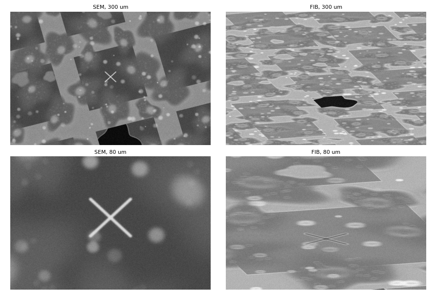
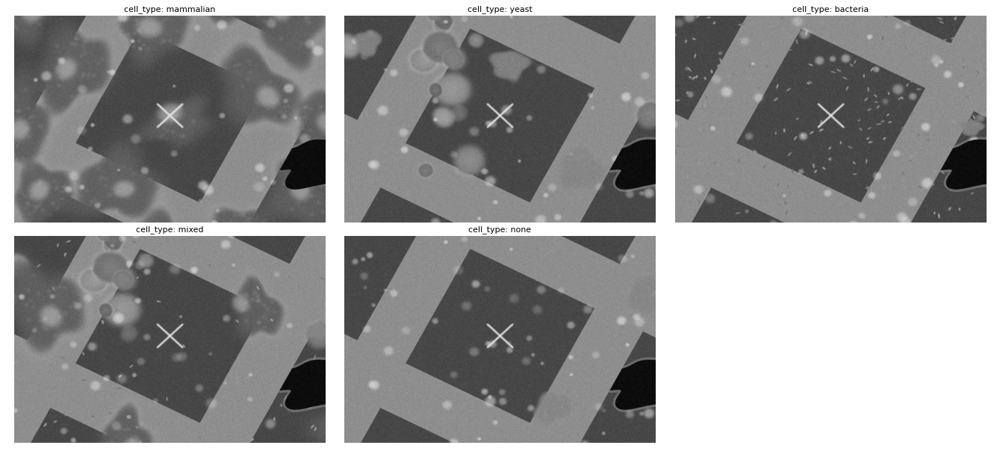
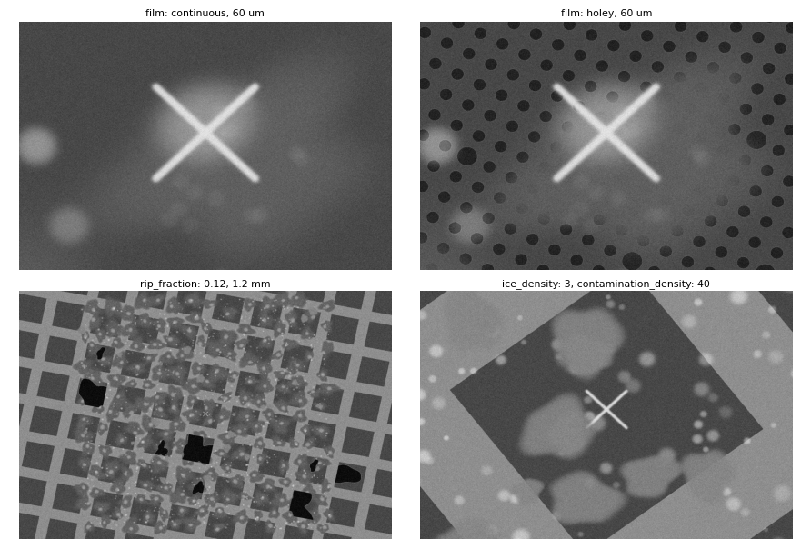
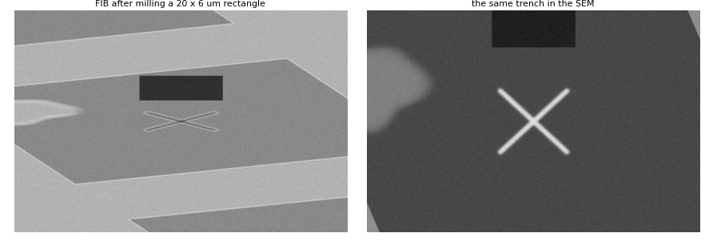
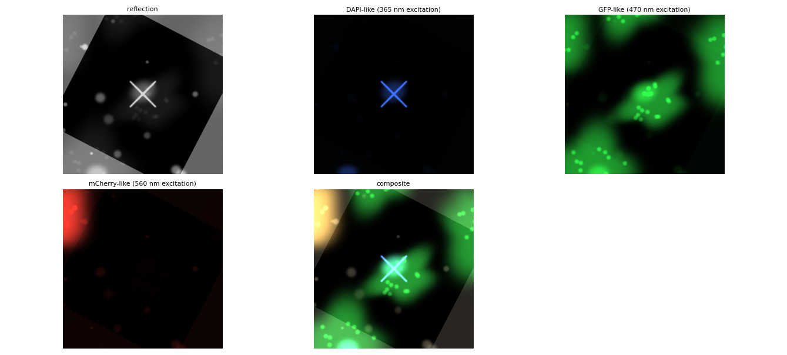
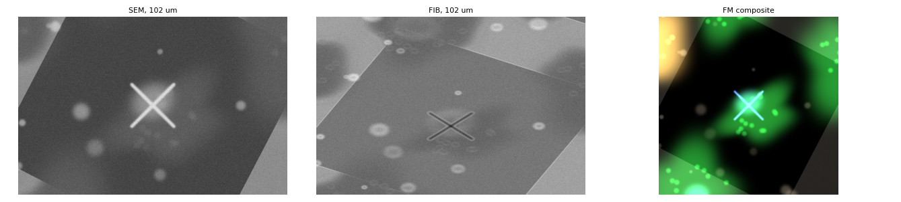
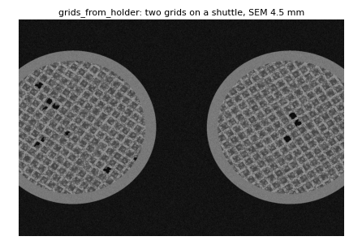

# The simulator

`manufacturer: Demo` in a microscope configuration connects to `DemoMicroscope`: a full
microscope in software. It has both beams, a fluorescence microscope, a stage with the
same geometry model as the hardware drivers (pre-tilted shuttle or compustage), a sample
holder with slots and, when configured, an autoloader magazine. Every workflow, task and
UI runs against it unchanged, which is how most of fibsem-os is developed and tested.

With the **sample scene** on, the beams image a synthetic cryo-grid instead of noise: a mesh of bars and film with cells, contamination, ice and
rips on it, that both beams and the fluorescence camera see through their own
projections. The same world persists across stage moves, tilts, scan rotations and beam
shifts, so navigation, tiling, alignment and milling can be exercised for real.

## Turning the scene on

```yaml
sim:
    sample:
        enabled: true
        coincidence_offset: 8.0e-6      # height error at boot (m)
```

Everything else has a default. The two development configurations that ship,
[sim-arctis](../fibsem/config/sim-arctis-configuration.yaml) (compustage, with FM) and
[sim-iflm](../fibsem/config/sim-iflm-configuration.yaml), have the scene on with the
common keys spelled out; `microscope-configuration.yaml` (the shuttle Demo the tests run
on) leaves it off, so its beams return noise.

## What the beams see



The scene is one world on the sample plane. Each beam renders it through the same
`BeamStageProjection` the app uses to draw saved positions and stitch overviews, so the FIB
view is foreshortened by the beam's angle to the surface, a height error shows as a
vertical displacement between the views (what the coincidence alignment measures), scan
rotation turns the content, and a beam shift moves it.

Contrast is per beam, not one image inverted for the other: holes, rips and trenches are
dark in both (no material, no signal); cell bodies are bright mounds in the SEM and read
slightly darker than the film in the FIB with a bright outline (the edge effect); the film
brightens at grazing incidence.

## Cell types



`cell_type` picks what grows on the film: `mammalian` (adherent, spread bodies with an
off-centre nucleus and organelle speckle; the default), `yeast` (compact ovoids in
clusters, some budding), `bacteria` (dense small rods), `mixed`, or `none` for bare film.
Cell bodies are opaque: they hide the film, holes and bars under them.

## Film, rips, ice and contamination



- **Film**: `continuous` by default, or `holey` for a Quantifoil-style lattice of round
  holes (`hole_diameter`, `hole_pitch`, a seeded few broken). The holey lattice is a 4 um
  periodic pattern the fine-pass coincidence correlator can alias on; see the note below.
- **Rips**: a seeded fraction of squares (`rip_fraction`) has the film torn away. Each rip
  is its own tear (size, orientation, where it starts, how ragged), a square beside a
  ripped one rips more readily, and a bright curled edge rings each rip.
- **Ice** (`ice_density`): flat bright plates with an irregular outline.
- **Contamination** (`contamination_density`): small bright specks over film and bars
  alike, the aperiodic content that breaks a mesh-pitch alias in real images.

## Milling leaves marks



When milling runs, the drawn patterns are committed to the world as trenches (polygons on
the surface, so a rectangle rotated in the FIB view lands where the surface has it). From
then on every view, either beam, any tilt, shows them.

## The fluorescence view



The FM camera images the same world through the FM projection, with a dye model keyed on
the excitation line: reflection shows the grid (bars bright, holes and rips dark, cells
faintly); a DAPI-like line lights nuclei and the fiducial; a GFP-like line the cell
bodies; an mCherry-like line a seeded subset of cells (`red_fraction`). Anything else
renders dark. The objective's distance from focus blurs the frame. The panels are shown
in the false colour a viewer gives each channel, and composited the way a CLEM overlay is.

## One world, three views



The same stage position through the three projections: the SEM looks down on the
surface, the FIB sees it foreshortened at its angle, and the FM camera images it through
its own tilt and transform. A feature clicked in one view is where the other two say it
is, because every view is drawn from one world through the app's own projection code.

## Grids at the holder's slots



With `grids_from_holder: true` the scene places one grid at every holder slot that has a
calibrated position and a loaded grid, centred where the slot's stage position falls,
and shows the holder between them. A grid's content is seeded from its name, so
exchanging grids between slots moves their cells with them. Off (the default), or with no
such slot, there is one grid centred on the position the stage was at when it connected.

To set a two-grid shuttle up on the Demo: calibrate the two slots with the holder
calibration wizard (Microscope tab, Sample Holder panel) at two stage positions a few
millimetres apart, put a grid in each slot, and set `grids_from_holder: true` in the
configuration's `sample:` block. The holder file is shared by every configuration in the
directory, which is why the option is per configuration.

## Coincidence and stage geometry

`coincidence_offset` is the height error the stage boots with: the SEM view barely
moves, the FIB view is displaced by the view tilt's worth, and the coincidence alignment
(Development menu) measures and removes it. `tilt_axis_offset` makes the stage
non-eucentric: the surface sits that far above the tilt axis, so a tilt change swings it,
which is what the tilt alignment corrects. `beam_offset` adds a persistent per-beam
lateral misalignment, and `current_offset_scale` a seeded offset per beam current, so the
milling-current alignment has something real to undo.

## Keys

All keys of the `sim: sample:` block, by what they control, with their defaults. Angles
are in degrees, ranges are two-element lists, lengths in metres.

<!-- sample-keys:start -->
### Stage and coincidence

| key | default | what it does |
| -- | -- | -- |
| `coincidence_offset` | 1e-05 | height error at boot (m): what the coincidence alignment corrects |
| `tilt_axis_offset` | 0 | how far the surface sits above the tilt axis (m); 0 is eucentric |

### Beams

| key | default | what it does |
| -- | -- | -- |
| `beam_offset` | {} | per-beam misalignment `{electron: [dx, dy], ion: [dx, dy]}` (m): a persistent lateral offset |
| `current_offset_scale` | 0 | sigma (m) of a seeded per-(beam, current) offset; 0 is off |

### Grid and film

| key | default | what it does |
| -- | -- | -- |
| `grid_pitch` | 0.000125 | mesh pitch (m); 125 um is a 200 mesh |
| `grid_bar_width` | 3.5e-05 | bar width (m) |
| `grid_intensity` | 90 | how bright the bars read in the SEM (0-255 scale) |
| `grid_radius` | 0.0014 | usable film radius (m); past it the rim, then the holder |
| `grid_rim_width` | 0.00015 | the metal rim's width (m) |
| `grid_rotation` | unset | the grid's rotation (deg); random within the range when unset |
| `grid_rotation_range` | 45 | the random rotation's range (deg) |
| `film` | continuous | `continuous` (default) or `holey` (a Quantifoil-style lattice) |
| `hole_diameter` | 2e-06 | holey film: hole diameter (m) |
| `hole_pitch` | 4e-06 | holey film: hole pitch (m) |
| `broken_hole_fraction` | 0.02 | holey film: fraction of holes broken into larger openings |
| `fiducial` | False | a cross at each grid centre, a navigation landmark; absent on a real grid, so off by default |

### Cells

| key | default | what it does |
| -- | -- | -- |
| `cell_type` | mammalian | `mammalian` (default), `yeast`, `bacteria`, `mixed`, `none` |
| `extent` | 0.0008 | content is grown over +/- extent/2 about the grid centre (m) |
| `mammalian_density` | 7 | mammalian: cells per 150 x 150 um |
| `mammalian_radius` | [1.8e-05, 3e-05] | mammalian: body radius range (m) |
| `nucleus_radius` | [5e-06, 7e-06] | mammalian: nucleus radius range (m) |
| `n_clusters` | 35 | yeast: clusters over the extent |
| `cells_per_cluster` | [3, 8] | yeast: cells per cluster (inclusive range) |
| `cell_size` | [4.5e-06, 1.2e-05] | yeast: sigma range per cell (m) |
| `cluster_spread` | 1.5e-05 | yeast: how far cells scatter round a cluster (m) |
| `bacteria_density` | 160 | bacteria: rods per 150 x 150 um |
| `bacteria_length` | [2e-06, 3.5e-06] | bacteria: rod length range (m) |

### Rips, ice and contamination

| key | default | what it does |
| -- | -- | -- |
| `rip_fraction` | 0.03 | fraction of squares with the film torn; neighbours rip more readily |
| `ice_density` | 0.4 | ice crystals per 100 x 100 um |
| `ice_size` | [6e-06, 1.6e-05] | ice plate radius range (m) |
| `contamination_density` | 15 | specks per 100 x 100 um, on film and bars alike |
| `contamination_size` | [8e-07, 3e-06] | speck sigma range (m) |

### Noise

| key | default | what it does |
| -- | -- | -- |
| `noise_sigma` | 12 | gaussian noise on the final image |
| `noise_fraction` | 0.15 | blend of full-range uniform noise (0-1) |

### Fluorescence

| key | default | what it does |
| -- | -- | -- |
| `red_fraction` | 0.4 | fraction of cells carrying the subset (mCherry-like) dye |
| `fm_blur_px_per_um` | 0.6 | FM defocus blur, pixels per micron the objective is off focus |

### Holder

| key | default | what it does |
| -- | -- | -- |
| `grids_from_holder` | False | grids at the holder's calibrated, occupied slots (opt-in) |

### Reproducibility

| key | default | what it does |
| -- | -- | -- |
| `seed` | 24 | the draw everything grows from; same seed, same scene |
<!-- sample-keys:end -->

## Cost and limits

- A frame renders in about 0.3 s at 1536 x 1024 once a place has been imaged; the first
  frame somewhere new costs 0.4-2 s (the world is stamped into cached tiles, then sampled
  per view). The fluorescence view is stamped per frame, about 0.4 s.
- The holey film's 4 um lattice defeats the fine-pass coincidence correlator (band
  refusals, a false convergence at large errors); keep the film continuous for alignment
  work until the measurement handles it.
- The scene is generated fresh from its seed on every connect. The same seed gives the
  same grid; milled trenches do not survive a reconnect.

The figures on this page are rendered with `fiducial: true` (a landmark for the eye;
off by default) by
[`render_simulator_examples.py`](developers/render_simulator_examples.py) from the current
code, and the key tables are read from the scene's defaults; rerun it after changing the
simulator.
